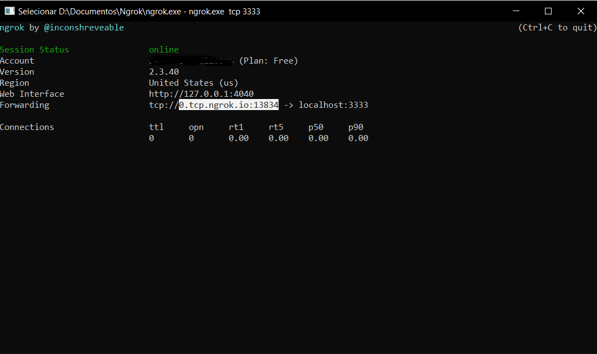

# HTTP-Download-Server

This download server was made using Ruby's TCP Socket and Ngrok for tunelling. I implemented a HTTP protocol to comunicate to the server via browser.

## How it works:

The ruby script cretes a TCP socket listening on the port 3333. The client connects to the server via browser(GET / HTTP/1.1) and the available files and directorys are listed on the screen. 

When a file is selected, the browser makes a GET request to server, who send's the file via TCP.

## Requirements

- [Ruby](https://www.ruby-lang.org/en/downloads/)
- [Ngrok](https://ngrok.com/download)

## How to use it

1. Start a TCP Tunnel using Ngrok
    ```
    ngrok.exe tcp 3333
    ```
2. Copy the selected address as the example below
    

3. Run the server.rb
    ```
    ruby server.rb
    ````
4. Paste the address on your browser


